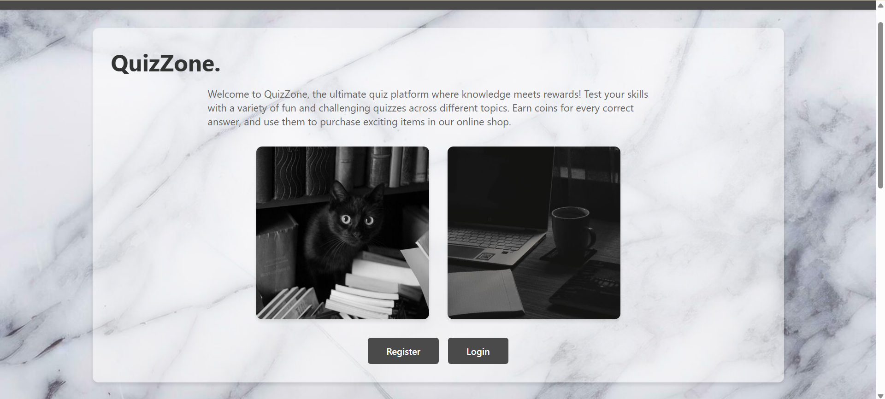
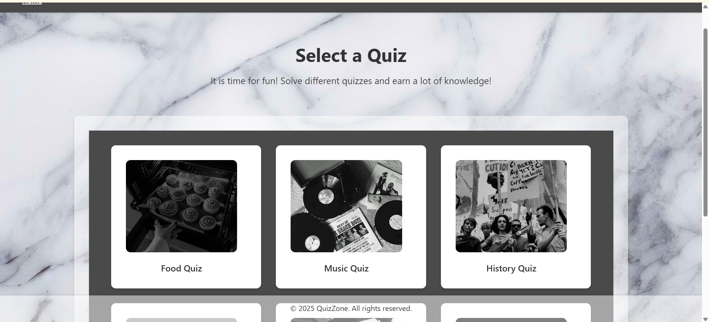
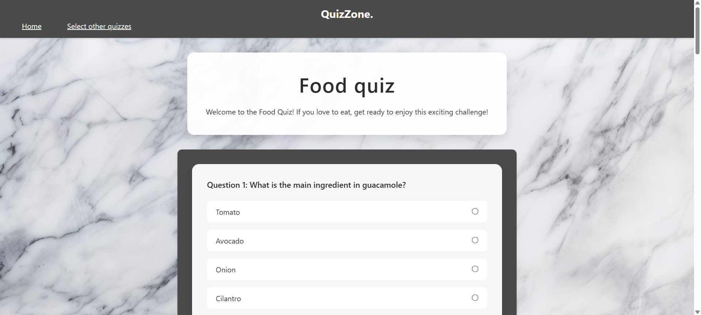
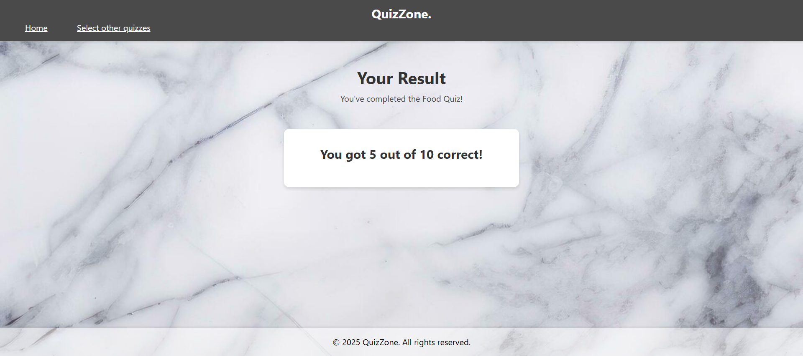

# 🎯 QuizZone - Interactive Knowledge Testing Platform


A full-stack web application that provides an engaging quiz platform across multiple knowledge categories. Built with Flask, featuring user authentication, database management, and an intuitive user interface.

---

## 📸 Screenshots

### Intro Page

*Clean, modern interface welcoming users to QuizZone*

### Quiz Selection

*Choose from six different quiz categories*

### Quiz Interface

*Interactive questions with radio button selections*

### Results Page

*Detailed score breakdown with encouragement*

---

## ✨ Features

### Core Functionality
-  **Secure Authentication**: User registration and login with bcrypt password hashing
- 📝 **Multiple Quiz Categories**:
  -  Food Quiz (10 questions)
  -  Music Quiz (10 questions)
  -  History Quiz (10 questions)
  -  Travel Quiz (10 questions)
  -  Psychology Quiz (10 questions)
  -  Special Quiz (surprise content!)
-  **Score Tracking**: Complete quiz history stored in database
-  **Modern UI**: Responsive design with smooth animations
-  **Protected Routes**: Login required for quiz access
-  **User Profiles**: Track all quiz attempts and scores

---

### Technical Features
- **Flask-Login** integration for session management
- **SQLAlchemy ORM** for database operations
- **Form validation** on both client and server side

---

## 🛠️ Tech Stack

### Backend
- **Flask 3.0.0** - Web framework
- **Flask-SQLAlchemy 3.1.1** - ORM for database management
- **Flask-Login 0.6.3** - User session management
- **bcrypt 4.1.2** - Password hashing

### Frontend
- **HTML5** - Semantic markup
- **CSS3** - Modern styling with Flexbox/Grid

---

## 📋 Prerequisites

- Python 3.8 or higher
- pip (Python package manager)
- Git
- Virtual environment (recommended)

---

## 🚀 Quick Start

### 1. Clone the Repository

```bash
git clone https://github.com/yevadjann/Group_Project_Website.git
cd Group_Project_Website
cd quize_website
```

### 2. Create Virtual Environment

```bash
# Windows
python -m venv venv
venv\Scripts\activate

# macOS/Linux
python3 -m venv venv
source venv/bin/activate
```

### 3. Install Dependencies

```bash
pip install -r requirements.txt
```

### 4. Initialize Database

```bash
python
>>> from app import app, db
>>> with app.app_context():
...     db.create_all()
>>> exit()
```

### 5. Run the Application

```bash
python app.py
```

Visit `http://127.0.0.1:5000` in your browser.

---

## 📁 Project Structure

```
quiz_website/
│
├── app.py                          # Main Flask application
├── models.py                       # Database query utilities
├── sql_creation.py                 # database management
├── requirements.txt                # Python dependencies
│
├── instance/
│   └── database.db                 # SQLite database (auto-generated)
│
├── static/
│   ├── css/
│   │   ├── style_index.css         # Landing page styles
│   │   ├── style_login.css         # Login page styles
│   │   ├── style_register.css      # Registration styles
│   │   ├── style_select_quiz.css   # Quiz selection styles
│   │   ├── style_quizzes.css       # Quiz page styles
│   │   └── quiz_result.css         # Results page styles
│   └── images/
│       ├── food_image.jpg
│       ├── music_image.jpg
│       ├── history_image.jpg
│       ├── travel_image.jpg
│       ├── psychology_image.jpg
│       └── special_quiz.jpg
│
└── templates/
    ├── index.html                  # Landing page
    ├── register.html               # User registration
    ├── login.html                  # User login
    ├── select_quiz.html            # Quiz category selection
    ├── food_quiz.html              # Food quiz questions
    ├── music_quiz.html             # Music quiz questions
    ├── history_quiz.html           # History quiz questions
    ├── travel_quiz.html            # Travel quiz questions
    ├── psychology_quiz.html        # Psychology quiz questions
    ├── special_quiz.html           # Special quiz questions
    └── quiz_result.html            # Results display

---

## 💾 Database Schema

### User Table
| Column   | Type    | Description              |
|----------|---------|--------------------------|
| id       | Integer | Primary key              |
| username | String  | Unique username          |
| email    | String  | Unique email address     |
| password | String  | Bcrypt hashed password   |

### QuizResult Table
| Column           | Type    | Description                    |
|------------------|---------|--------------------------------|
| id               | Integer | Primary key                    |
| user_id          | Integer | Foreign key to User            |
| quiz_name        | String  | Name of the quiz taken         |
| score            | Integer | Number of correct answers      |
| total_questions  | Integer | Total number of questions      |

### QuizAnswer Table (for detailed tracking)
| Column      | Type    | Description                |
|-------------|---------|----------------------------|
| id          | Integer | Primary key                |
| user_id     | Integer | Foreign key to User        |
| question_id | Integer | Question identifier        |
| answer      | String  | User's selected answer     |
| quiz_name   | String  | Name of the quiz           |

---

## 🎮 How to Use

1. **Register an Account**
   - Click "Register" on the homepage
   - Enter username, email, and password
   - Submit to create your account

2. **Login**
   - Use your email and password
   - Get redirected to quiz selection

3. **Take a Quiz**
   - Select a quiz category
   - Answer all 10 questions
   - Submit to see your results

4. **View Results**
   - See your score
   - Check which questions you got right/wrong
   - Your score is automatically saved

---

## 🔒 Security Features

### Implemented
- ✅ Password hashing with bcrypt (strong salt rounds)
- ✅ Flask-Login session management
- ✅ SQL injection protection via SQLAlchemy ORM
- ✅ Input validation on forms
- ✅ Protected routes requiring authentication

## 👥 Authors

- **Yeva Zembytska** - *Co-developer* - [GitHub Profile](https://github.com/yevadjan)
- **Gurowamuki** - *Co-developer* - [GitHub Profile](https://github.com/gurowamuki)